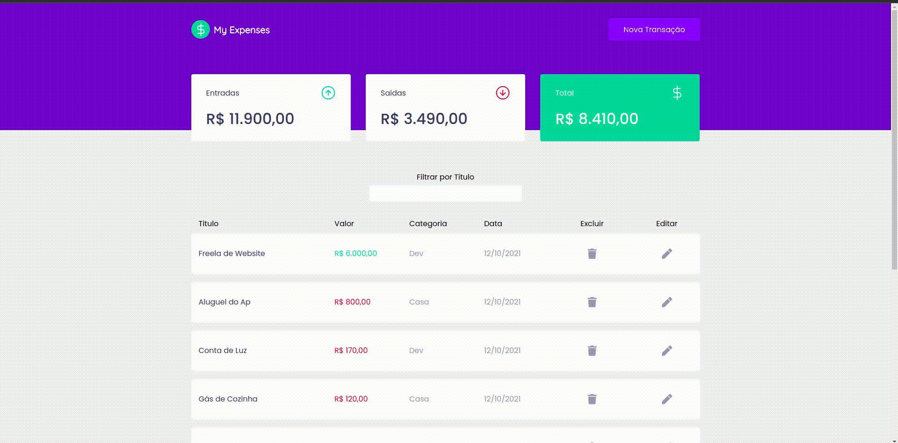

<h1 align="center">
  
</h1>

## 🙂 Demonstration



## 📝 Project

This project was developed during the classes in Chapter II of the Rocketseat Bootcamp Ignite ReactJS track,
and where in the initial project it was only possible to create and list the expenses.

The following features have been added by me:

#### Exclude an expense
#### Edit an expense
#### Filter spent by title

## 💻 Getting started

### Requirements

- [Node.js](https://nodejs.org/en/)
- [Yarn](https://classic.yarnpkg.com/) or [NPM](https://www.npmjs.com/) _(examples are with yarn)_

**Clone the project and access the folder**

```bash
$ git clone https://github.com/antonioluciofb/myexpenses.git && cd myexpenses
```

**Follow the steps below**

```bash
# Install the dependencies
$ yarn
# Start the app
$ yarn start
```

## Dependencies

- [axios](https://ghub.io/axios): Promise based HTTP client for the browser and node.js
- [miragejs](https://ghub.io/miragejs): A client-side server to help you build, test and demo your JavaScript app
- [polished](https://ghub.io/polished): A lightweight toolset for writing styles in Javascript.
- [react](https://ghub.io/react): React is a JavaScript library for building user interfaces.
- [react-dom](https://ghub.io/react-dom): React package for working with the DOM.
- [react-icons](https://ghub.io/react-icons): SVG React icons of popular icon packs using ES6 imports
- [react-modal](https://ghub.io/react-modal): Accessible modal dialog component for React.JS
- [react-scripts](https://ghub.io/react-scripts): Configuration and scripts for Create React App.
- [styled-components](https://ghub.io/styled-components): Visual primitives for the component age. Use the best bits of ES6 and CSS to style your apps without stress
- [uuid](https://ghub.io/uuid): RFC4122 (v1, v4, and v5) UUIDs
- [web-vitals](https://ghub.io/web-vitals): Easily measure performance metrics in JavaScript
